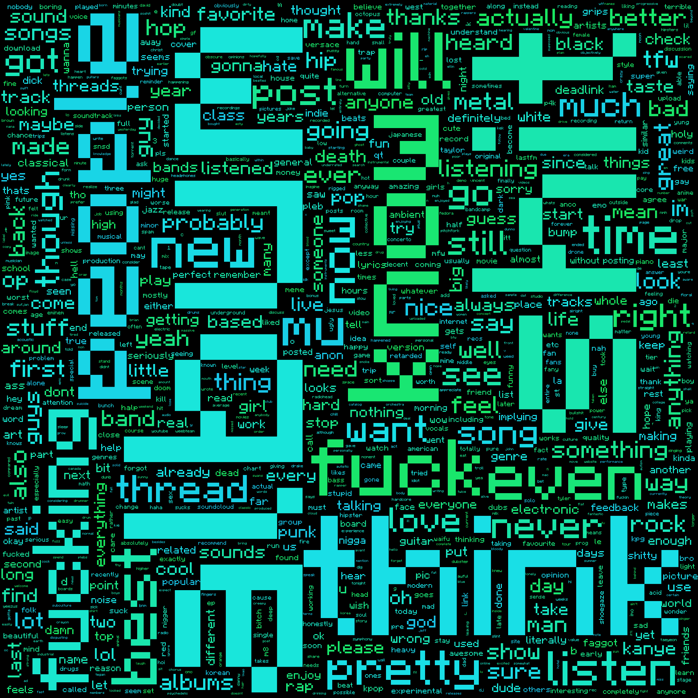

4chdm
=====

4chan data mining project

This is a very simple idea. I get the JSON representations of threads through 4chan's public API, and 
manipulate them with sed, awk and tr to get all the text contained in a single board. You can set this
up to run as a cron job, and start collecting text

The stucture is as follows: 
* 4ch_get_threads gets called first
* After it finishes creating a file containing all the thread numbers, it calls 4ch_threadloop
* Threadloop iterates the file, calling 4ch_gettext on each thread, and filling a .words file with all the thread's text

After this, you have a '4chdata' directory full of .words files, one for each thread.
 
* 'get' creates a file (all.dat) containing a somewhat filtered concatenation off all .words files.
* 'freq' reads 'all.dat' and makes a tab-separated file (freq.dat) that contains every word once, with its frequency on each line.
* 'final' deletes the words in 'freq.dat' that have a frequency <4, and puts the result in a new file (final.dat)
* 'sort' just sorts 'final.dat'  in descending order of frequency, and puts the result in a new file (gg.dat)

I create word clouds using the 'all.dat' file and this: https://github.com/amueller/word_cloud

For now, I'm focusing on the /mu/ board. Here are some word cloud examples: 

That's all for the moment :3
